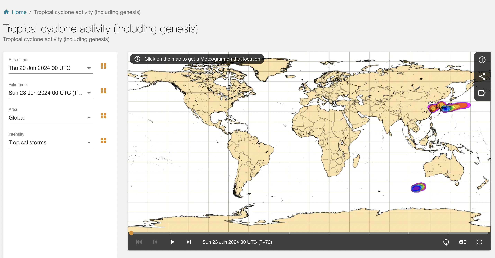
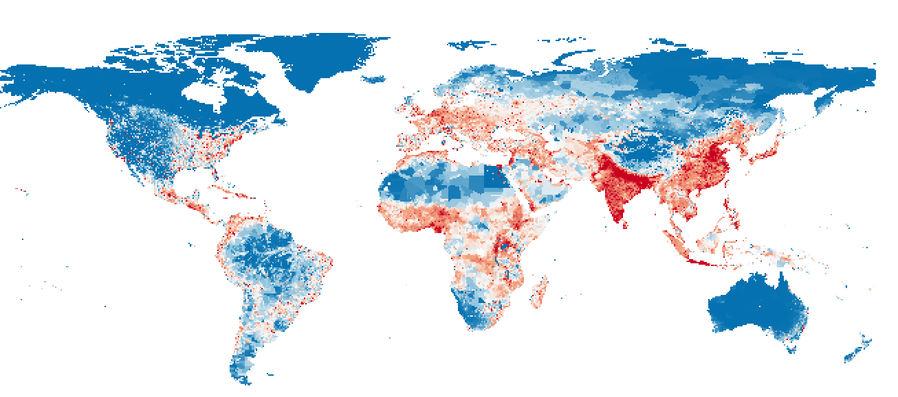
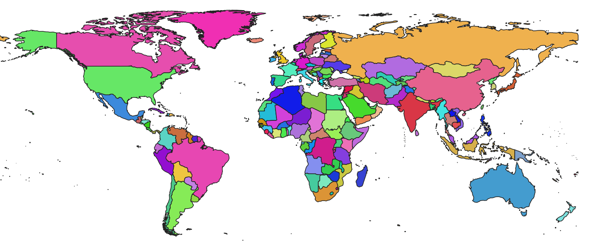
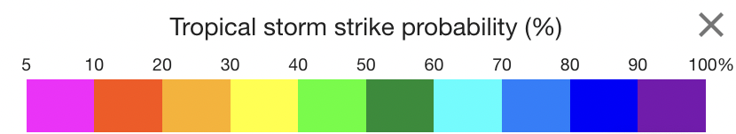
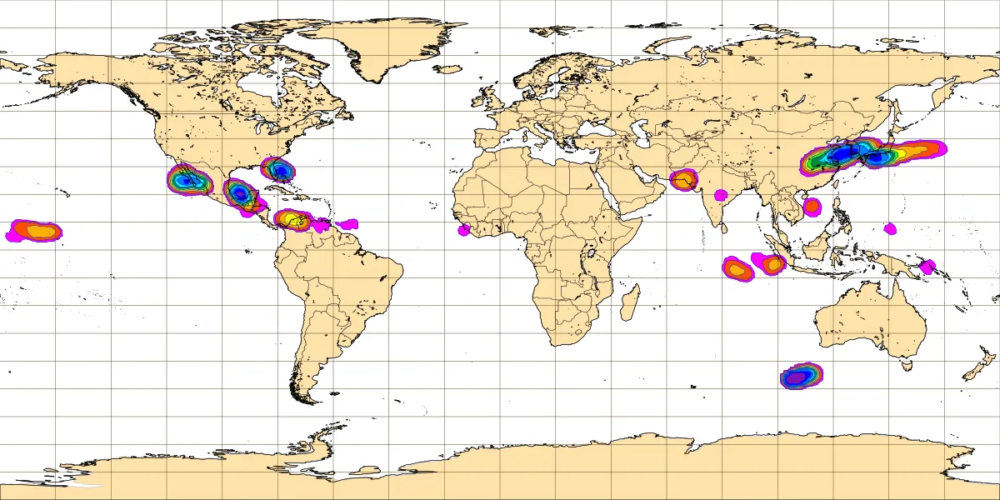
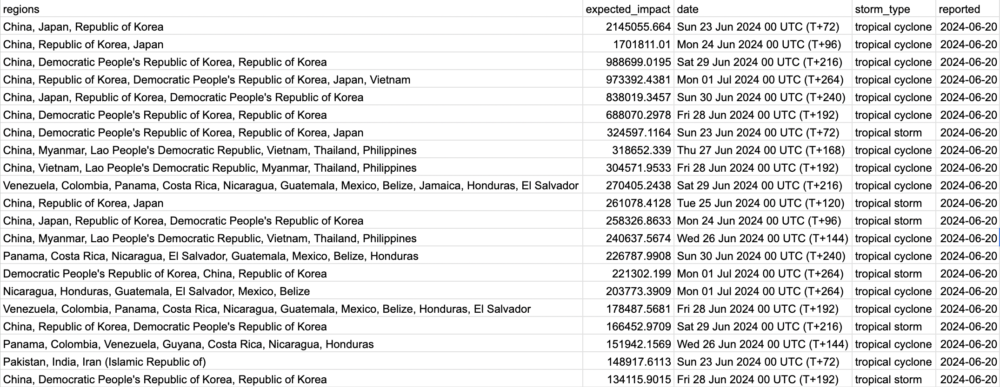

StormSpyder is a web scraping tool designed to access the latest tropical storm data from the European Centre for Medium-Range Weather Forecasts (ECMWF), detecting strike probabilities for tropical storms, tropical cyclones, and hurricanes up to nine days in advance. This information is then cross-referenced with a 2.5km resolution population map, producing calculations of the expected impact of the storm event on local populations. Results are then emailed to key parties on the StormSpyder mailing list.

This tool is intended for use by humanitarian and global development agencies to provide a concise summary of storm events which might merit humanitarian response.

## How it Works

StormSpyder scrapes the [ECMWF tropical storm genesis website](https://charts.ecmwf.int/products/medium-tc-genesis?base_time=202406200000&layer_name=genesis_ts&projection=opencharts_global&valid_time=202406230000) for daily nine-day forecasts of tropical storms, tropical cyclones, and hurricanes. The free version of these forecasts is only available as an image. StormSpyder digitises these images by georeferencing the map with a real-world map of the same cylindrical projection. It then detectes coloured pixels indicating forecast probabilities of the storm events. 

These strike probabilities are then intersected with a 2.km resolution gridden population map to calcualte the expected number of people impactd by the storm events (equal to the forecasted probabilities multiplied by the population in the regions that intersect with the forecasted storm).

The names of the countries that are affected by each forecasted storm are also extracted, using a global administrative boundaries map.

StormSpyder runs on an Amazon Web Services (AWS) instance and issues storm alerts via email every morning at 6.00 GMT.

## Information Contained in the Alert

StormSpyder alerts report the expected impact of every ECMWF-forecast storm on the local population, as this is the most relevant information for action (calculating only land intersections wouldn't identify which storm events impact the most people). Expected impact is equal to the probability band of the storm event multiplied by the values of the population grid that the band intersects with. So for example, a band in the 10-20% range (red) that intersects with a population of one million would be calculated to have an expected impact of 0.15 * 1,000,000 = 150,000. The total expected impact for a storm event is the sum of these probability * population intersections for each probability band in a given storm event. This is the expected number of people who would be "impacted" in some way by the storm event.

StormSpyder is set up so that the subject line of the email lists the expected impact for the highest-expected impact storm event of the nine-day forecast period. The subject line of the email tells you the expected impact and exactly which countries this storm will affect. It also gives the date at which the impact is expected to be the highest. This way the important information from all the storm types, all the forecast dates, and all the individually forecasted storms can be distilled into a single easily digestible piece of information. Further details are contained in the body of the email, if additional information is needed.

The body of the emails contains the image taken from the ECMWF website with the highest impact storm, as well as a CSV file that has all the details (storm type, expected impact, impact date, countries affected, forecast date) for every storm event forecast by ECMWF over the next nine days. It's sorted by expected impact, so the storm events with higher expected impact are listed first. StormSpyder is set up to save all the data produced daily into one large CSV file, which may be useful for retrospective analysis.

## Running the Tool

Users can **message the algorithm creator (email below) to be added to the daily alert mailing list**. If tool customisation or ownership is desired, users can also adapt the code to run on their a cloud computing service (recommended) or their own device. To set up StormSpyder on your own instance of AWS, follow the instructions in [this tutorial](https://medium.com/@angelaniederberger/automated-web-scraping-with-aws-72b7f80c2927#9fa2). StormSpyder can be run on the AWS t3.small instance (2 GB RAM). It takes approximately 25 minutes to finish executing.

## Contact Information

Algorithm creator: Jess Rapson

Creator contact email: jessicakristenr@gmail.com

Date last reviewed: June 20, 2024
